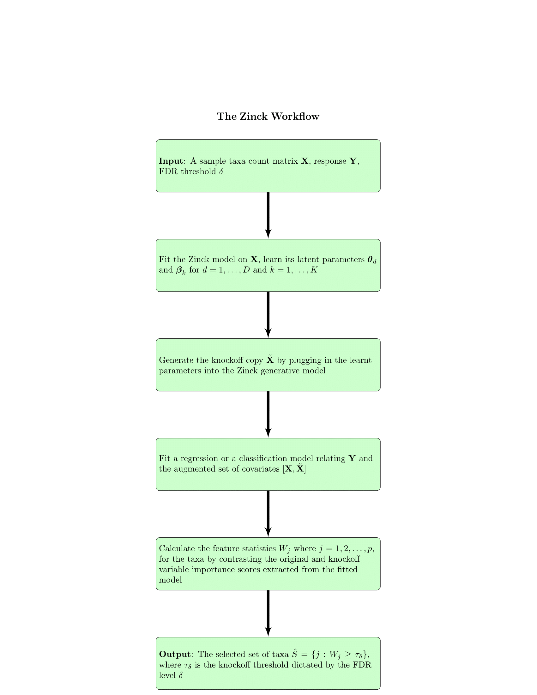

# zinck

## Overview
`zinck` is a novel knockoff-based framework specifically designed for microbiome data analysis. Microbiome datasets are often high-dimensional, compositional, and zero-inflated, posing unique challenges for statistical analysis and interpretation. `zinck` addresses these challenges by employing a flexible generative model that effectively captures the zero-inflation and complex dependence structure characteristic of microbial communities. This approach allows for simultaneous variable selection and false discovery rate (FDR) control, making `zinck` particularly suited for taxonomic variable selection in microbiome studies. 



**Visit the [Zinck Website](https://ghoshstats.github.io/zinck-website/) for some reproducible analyses from our paper and to explore its workflow!**

# Installation Guide for `zinck`

## System Requirements

Before installing `zinck`, ensure your system meets these requirements:
- R version 4.0.0 or higher (version 4.1.3 recommended)
- Rtools (for Windows users)
- A C++ compiler compatible with R

## Dependencies

`zinck` relies on several R packages. Most dependencies are automatically installed when you install `zinck`. However, special attention is needed for `rstan` and `StanHeaders` due to version compatibility.

### Core Dependencies

- `dplyr`
- `reshape2`
- `knockoff`
- `glmnet`
- `randomForest`
- `caret`
- `rstan` (version 2.21.7 or 2.21.8 recommended)
- `StanHeaders` (version 2.26.25)
- `stats`
- `fitdistrplus`
- `ggplot2`
- `MLmetrics`
- `phyloseq`
- `GUniFrac`
- `kosel`
- `gridExtra`
- `zinLDA`

### Suggested Packages

- `knitr`
- `rmarkdown`

## Installing `rstan` and `StanHeaders`

To use `zinck`, it's critical to install specific versions of `rstan` and `StanHeaders`. Follow these steps:

1. **Remove Older Versions**: If you have different versions of `rstan` or `StanHeaders` installed, remove them using:
   
    ```r
    remove.packages(c("rstan", "StanHeaders"))
    ```

2. **Install `StanHeaders` 2.26.25**:
   
    ```r
    packageurl <- "https://cran.r-project.org/src/contrib/Archive/StanHeaders/StanHeaders_2.26.25.tar.gz"
    install.packages(packageurl, repos=NULL, type="source")
    ```

3. **Install `rstan` 2.21.8**:

    ```r
    packageurl <- "https://cran.r-project.org/src/contrib/Archive/rstan/rstan_2.21.8.tar.gz"
    install.packages(packageurl, repos=NULL, type="source")
    ```

    Note: Installation from source requires Rtools (Windows) or the appropriate development tools for other operating systems.

4. **Verify Installation**: Ensure that the correct versions of `rstan` and `StanHeaders` are installed by running:

    ```r
    packageVersion("rstan") # Should return 2.21.8
    packageVersion("StanHeaders") # Should return 2.26.25
    ```

## Installing `zinck`

After ensuring that the correct versions of `rstan` and `StanHeaders` are installed, you can proceed with installing `zinck`.

1. **Install `devtools` Package**: If not already installed, you need `devtools` to install `zinck` from GitHub.

    ```r
    if (!require("devtools")) install.packages("devtools")
    ```

2. **Install `zinck`**:

    ```r
    devtools::install_github("ghoshstats/zinck", build_vignettes = TRUE)
    ```

## Post-Installation

Once `zinck` is successfully installed, load it in R to begin your analysis:

```r
library(zinck)
```

## Examples and vignettes

To get started with zinck, explore the package vignettes and documentation:

```r
# View available vignettes
browseVignettes(package = "zinck")

To get started with zinck, explore the package documentation:
```
```r
# View package documentation
?zinck
```

## Getting Started

After installation, you can verify and get a feel for the package's capabilities through a practical example. This guide walks you through loading a dataset included with zinck, selecting samples, generating knockoffs, and performing variable selection. This example utilizes the `count.Rdata` dataset included in the zinck package. Ensure it's loaded correctly into your R session.

```r
# Load the dataset
load(data/count.Rdata)

# Simulation Design
generate_data <- function(p,seed){
  dcount <- count[,order(decreasing=T,colSums(count,na.rm=T),apply(count,2L,paste,collapse=''))] ## ordering the columns w/ decreasing abundance
  ####### Randomly sampling patients from 574 observations #######
  set.seed(seed)
  norm_count <- count/rowSums(count)
  col_means <- colMeans(norm_count > 0)
  indices <- which(col_means > 0.2)
  sorted_indices <- indices[order(col_means[indices], decreasing=TRUE)]
  if(p %in% c(100,200,300,400)){
    dcount <- count[,sorted_indices][,1:p]
    sel_index <- sort(sample(1:nrow(dcount), 500))
    dcount <- dcount[sel_index,]
    original_OTU <- dcount + 0.5
    seq_depths <- rowSums(original_OTU)
    Pi = sweep(original_OTU, 1, seq_depths, "/")
    n = nrow(Pi)
    
    col_abundances = colMeans(Pi)
    
    ##### Generating continuous responses ######
    set.seed(1)
    signals = (2 * rbinom(30, 1, 0.5) - 1) * runif(30, 1.5, 3)
    kBeta = c(signals / sqrt(col_abundances[1:30]), rep(0, p - 30))
    eps=rnorm(n,mean = 0, sd=1)
    Y <- Pi^2 %*% (kBeta/2) + Pi %*% kBeta + eps
    
    ##### Generating binary responses #####
    set.seed(1)
    signals = (2 * rbinom(30, 1, 0.5) - 1) * runif(30, 3, 10)
    kBeta = c(signals / sqrt(col_abundances[1:30]), rep(0, p - 30))
    pr = 1/(1+exp(-(Pi^2 %*% (kBeta/2) + Pi %*% kBeta)))
    Y_bin = rbinom(n,1,pr)
    
    ######### Generate a copy of X #########
    X <- matrix(0, nrow = nrow(Pi), ncol = ncol(Pi))
    nSeq <- seq_depths
    # Loop over each row to generate the new counts based on the multinomial distribution
    
    set.seed(1)
    
    for (i in 1:nrow(Pi)) {
      X[i, ] <- rmultinom(1, size = nSeq, prob = Pi[i, ])
    }  
  } else if (p %in% c(200,300,400)) {
    print("Enter p within 100 to 400")
  }
  colnames(X) <- colnames(Pi)
  return(list(Y = Y, X = X, Y_bin = Y_bin, index = 1:30))
}

ntaxa = 100 # Change to p = 200, 300, 400 accordingly.

X <- generate_data(p=ntaxa, seed=1)$X
Y1 <- generate_data(p=ntaxa, seed=1)$Y

# Fit the zinck model
fit <- fit.zinck(X,num_clusters = 15,method="ADVI",seed=12,elbo_samples = 100)

# Extract model parameters
beta <- fit[["beta"]]
theta <- fit[["theta"]]

# Generate knockoff features
X_tilde <- zinck::generateKnockoff(X,theta,beta,seed=1) ## getting the knockoff copy

# Perform variable selection
index_est <- suppressWarnings(zinck.filter(X,X_tilde,Y1,model="Random Forest",fdr=0.2,offset=0,mtry=200,seed=12,metric = "Accuracy", rftuning = TRUE))


index <- 1:30

# Evaluating model performance
TP <- sum(index_est %in% index) # True Positives
FP <- sum(!index_est %in% index) # False Positives
FN <- length(index) - TP # False Negatives

estimated_FDR <- FP / (FP + TP) # Evaluating the empirical False Discovery Rate
estimated_power <- TP / (TP + FN) # Evaluating the empirical Power or TPR

print(paste("Estimated FDR:", estimated_FDR))
print(paste("Estimated Power:", estimated_power))
```
## Replicate studies in the paper

Codes used to replicate both simulation and real data analyses are in the folder `Codes/`. 

### Simulation studies

There are two types of simulation studies: 

(1) Non-parametric Simulations -- where the microbiome data generating process is unknown and involves subsetting from the CRC species level data (https://github.com/zellerlab/crc_meta), also saved in the repository as ``count.Rdata``. The number of taxa is varied from 100 to 400 for both continuous and binary outcome types. The empirical detection powers along with FDRs are recorded for a range of target FDR thresholds. The codes to replicate the analysis can be found in `Codes/Non-parametric Simulations.R`.

(2) Parametric Simulations -- where the microbiome data generating process is known that is, either generated from a Dirichlet Multinomial (DM) setting or a Logistic Normal (LN) setting. The number of taxa is again varied from 100 to 400 and the empirical detection powers along with FDRs are recorded for a range of target FDR thresholds. The codes to replicate the analysis can be found in `Codes/Parametric Simulations.R`.


### Real data analyses

(1) CRC data analyses -- The codes to reproduce the Feature Statistics and the Venn Diagram representing the number of biomarkers detected for the `CRC` data can be found in `Codes/CRC-analysis.R`. 

(2) IBD data analyses -- The codes to reproduce the Feature Statistics and the Venn Diagram representing the number of biomarkers detected for the `IBD` data can be found in `Codes/IBD-analysis.R`. 

Furthermore, the codes replicating the Leave-one-study-out prediction analysis for both `CRC` and `IBD` studies can be found in `Codes/Prediction-analysis.R`

The heatmaps to compare the quality of knockoffs for `zinck` and other methods can be replicated using the codes in `Codes/Heatmaps.R`.

For any issues or further assistance, consult the zinck pdf manual saved as `zinck-manual.pdf` or visit the GitHub repository's Issues section.


